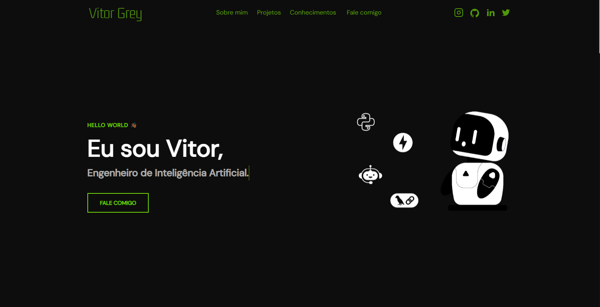

<h1 align="center">Portifólio - Lucyan 💻</h1>

<h4 align="center"><a href="https://staging.d1eaxlwkui9mlf.amplifyapp.com/">Confira o projeto aqui</a></h4>

---

## 💻 Sobre

Projeto feito no intuito de me apresentar, como Engenheiro de Inteligência Artificial.

## 🤯 O site é composto por:

- **Home:** Minha apresentação;
- **Sobre mim:** Falo um pouco sobre minha trajetória e meu estado atual;
- **Projetos:** Alguns projetos recentes que fiz;
- **Conhecimentos:** As tecnologias que tenho conhecimento;
- **Fale comigo:** Área com meios para contato comigo;
- **Redes:** Minhas redes sociais disponíveis no menu de navegação e no rodapé do site.

---

<table>
  <tr>
    <td>
      
    </td>
    <td>
      Feito por <a href="https://github.com/lvitorgrey">Vitor Grey.</a> 🙋🏿‍♂️
    </td>
  </tr>
</table>

## 🏆 Licença

The [MIT License](./LICENSE).
